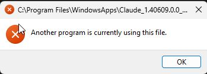

# restart-claude

A Windows recovery script for Claude Desktop when it will not reopen after an update or crash and Windows reports:

```text
C:\Program Files\WindowsApps\Claude_<version>_...
Another program is currently using this file.
```

This is commonly described as the Claude Desktop WindowsApps file lock, Claude MSIX stale lock, Claude file-in-use error, or Claude not opening after a crash.



Exact searchable text from the included screenshot:

```text
Window title: C:\Program Files\WindowsApps\Claude_1.40609.0.0_...
Message: Another program is currently using this file.
```

## Important warning

`restart_claude.bat` forcibly terminates **every running Node.js, Python, and Tail process**, including processes unrelated to Claude. Unsaved work, local servers, automation jobs, and development sessions using those runtimes will be stopped.

The script displays this warning and requires an explicit `Y` confirmation before changing anything.

## What it does

1. Requests administrator permission for the cleanup step.
2. Stops Claude's `CoworkVMService`.
3. Terminates Claude and Cowork process trees.
4. Terminates all detected Node.js, Python, and Tail processes in three passes.
5. Attempts to restart Claude through its Windows app registration.
6. Falls back to known legacy Win32 installation locations when necessary.

The broad runtime cleanup is intentional. On the machine where this workaround was developed, stopping only Claude and `CoworkVMService` did not release the lock. Terminating the remaining Node.js, Python, and Tail processes did.

## Usage

1. Save [`restart_claude.bat`](restart_claude.bat) somewhere convenient.
2. Close or save work in Node.js, Python, and Tail applications.
3. Double-click `restart_claude.bat`.
4. Read the warning and press `Y` to continue.
5. Approve the Windows administrator prompt.

Claude should launch automatically when cleanup finishes. If the installation cannot be detected, open Claude from the Start menu.

## Supported installations

The restart step checks, in order:

- Windows Start-menu app registrations
- Claude MSIX/AppX packages installed under `C:\Program Files\WindowsApps`
- Legacy Claude installations below `%LOCALAPPDATA%\AnthropicClaude`
- Legacy Claude installations below `%LOCALAPPDATA%\Programs\Claude`

Custom, portable, enterprise-managed, or future installation layouts may require launching Claude manually after cleanup.

## Limitations

- Some background applications may immediately respawn Node.js, Python, or Tail processes.
- A kernel-level Windows AppContainer lock may still require signing out of Windows or restarting the computer.
- The script targets Windows only and requires PowerShell and administrator access.
- This project is an independent workaround and is not affiliated with Anthropic.

## License

[MIT](LICENSE)
